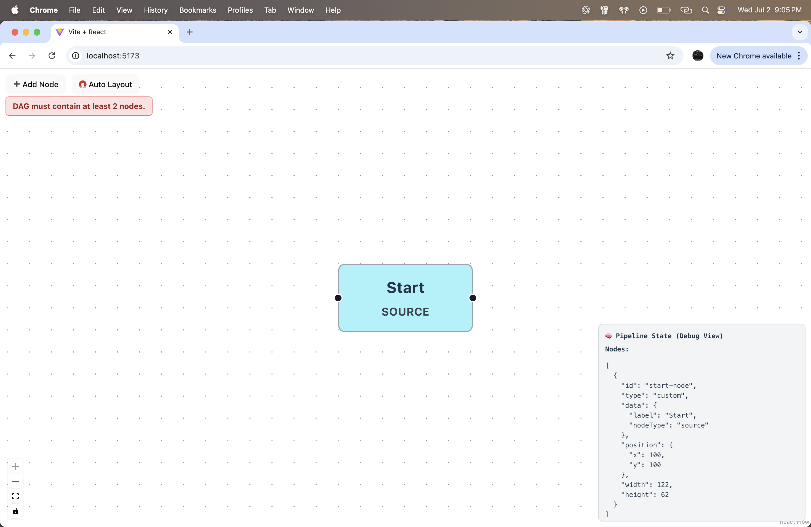
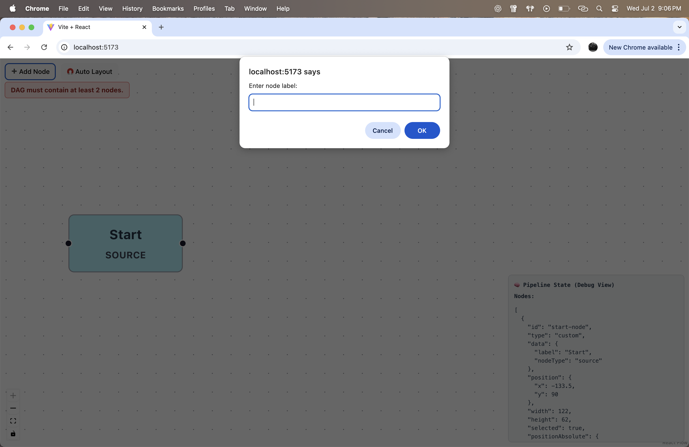
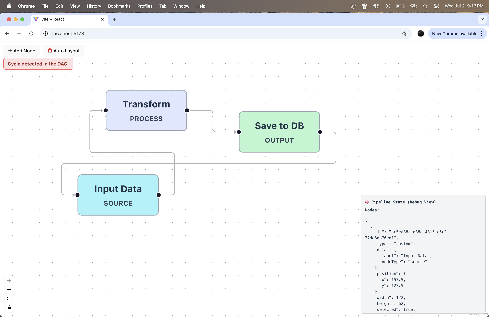
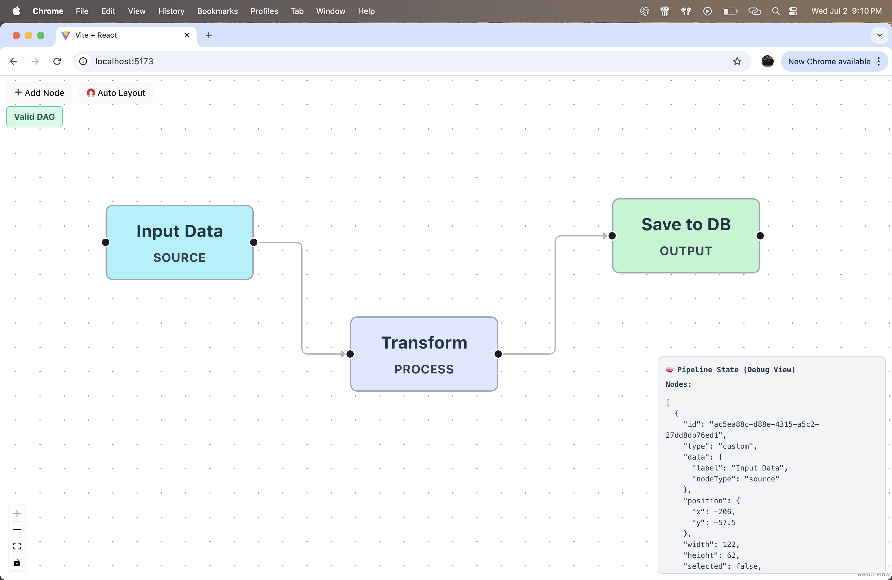
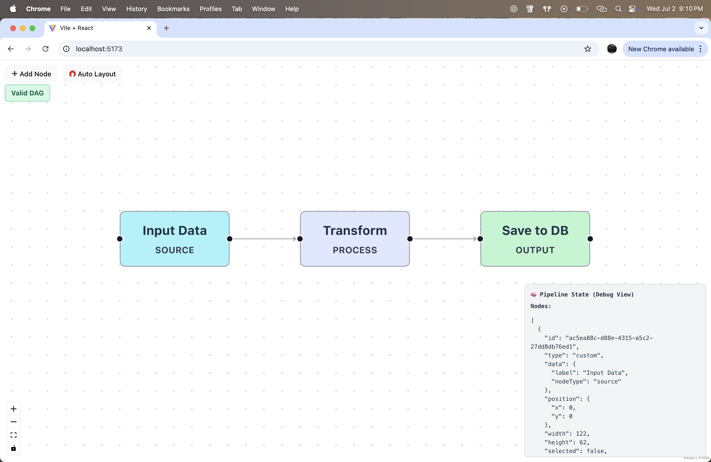
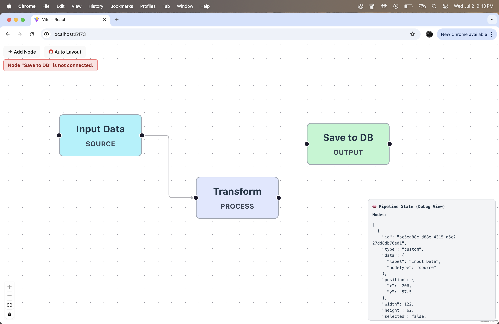
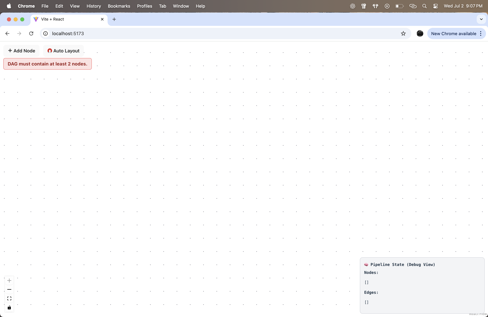

# 🛠️ Pipeline Editor (DAG Builder)

A visual editor to build and validate data pipelines using a directed acyclic graph (DAG) in React.

---

## 🚀 Demo

👉 [Click here to view live demo](https://pipeline-editor-psi.vercel.app/)

---

## ✨ Features

- Add nodes with custom labels and types (source, process, output)
- Drag and connect nodes with directional edges
- Validate graph as a proper DAG (no cycles, minimum 2 nodes, all connected)
- Delete nodes/edges using the `Delete` key
- Auto-layout using `dagre`
- Real-time JSON debug panel

---

## 🧱 Tech Stack

- React (via Vite)
- React Flow
- Dagre (for layout)
- Zustand (via React Flow)
- JavaScript (ES6)

---

## 🧪 How to Run Locally

```bash
git clone https://github.com/Sachi34129/pipeline-editor
cd pipeline-editor
npm install
npm run dev
```

---

## 📁 Folder Structure

```
pipeline-editor/
├── public/
├── src/
│   ├── App.jsx
│   ├── CustomNode.jsx
│   ├── validateDAG.js
│   └── layoutGraph.js
├── screenshots/
│   ├── demo1.png
│   └── demo2.png
├── README.md
├── package.json
├── vite.config.js
└── index.html

```

---

## 📸 Screenshots

### 🧩 Start Node Creation


### 🧠 Enter Node Label


### 🔁 Cycle Detected in DAG


### ✅ Valid DAG (Before Layout)


### 🔃 Auto Layout Applied


### ⚠️ Disconnected Node Warning


### ❌ Empty Graph


---

## 🎥 Demo Walkthrough (Screen Recording with Voiceover)

> 🔗 [Click here to watch the screen recording on Google Drive](https://drive.google.com/file/d/your-drive-id/view)

This recording shows how to:
- Add and connect nodes
- Validate DAG
- Trigger auto layout
- Handle common errors like disconnected nodes or cycles

---

## 💡 Library Decisions

- **React + Vite**: Chosen for fast development experience with Hot Module Replacement and minimal setup overhead.
- **React Flow**: Provides a robust and interactive graph-building experience with support for custom nodes and edges.
- **Dagre**: Used to automatically layout the DAG in a readable left-to-right format.
- **Zustand**: Lightweight state management integrated seamlessly with React Flow’s internal store.
- **JavaScript (ES6)**: Clean, modern syntax to keep the project lightweight and beginner-friendly.

---

## 🧠 Challenges Faced

### 1. DAG Validation  
Detecting cycles and ensuring a minimum valid structure (at least 2 nodes, all connected) required implementing custom validation logic using **Depth-First Search (DFS)**. Edge cases like unconnected nodes or self-loops had to be carefully handled.

### 2. Auto Layout  
Using **Dagre** for layout introduced complexities in preserving existing node positions while rearranging the graph. Mapping between React Flow's coordinates and Dagre's layout engine took careful adjustment.

### 3. State Synchronization  
React Flow’s internal state had to be tightly synchronized with custom validation logic, edge drawing, node labeling, and layout. Managing this dynamically while maintaining performance required thoughtful use of **Zustand**.

---

## 📚 References

- 📘 [React Flow Documentation](https://reactflow.dev/)
- 📘 [Dagre Graph Layout](https://github.com/dagrejs/dagre)
- 📘 [Zustand - A Bear Necessity for State Management](https://github.com/pmndrs/zustand)
- 📘 [Vite + React Starter Template](https://vitejs.dev/guide/)
- 📘 [Depth-First Search Algorithm – GeeksforGeeks](https://www.geeksforgeeks.org/depth-first-search-or-dfs-for-a-graph/)
